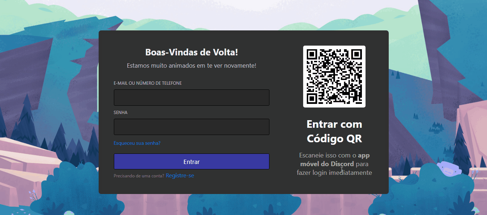

# README

<h1 align="center">Clone: Tela de login do Discord</h1>

<h1 align="center">
    
</h1>

<h1 align="center">
    
</h1>

<h1 align="center">Sobre</h1>

É o que o nome diz, um clone da tela de login do Discord, usando somente HTML, CSS e JavaScript
  
<h1 align="center">Funcionalidades 🔧</h1>
<ul>
    <li>Validação de dados básica, não deixando que o usuário envie os dados se uma das caixas de inserção de dados estiverem vazias</li>
</ul>  

<h1 align="center">O que aprendi 👨‍💻</h1>
<ul>
    <li>Como fazer um sistema de validação de dados utilizando Eventos em JavaScript</li>
    <li>Aprimoramento de técnicas de estilização no CSS</li>
    <li>Aprendizado de novos métodos de organização da estrutura HTML</li>
</ul>  

Made with 💜 by João Artur 👋 See my <a href="https://www.linkedin.com/in/magalhesartur/">Linkedin</a>

